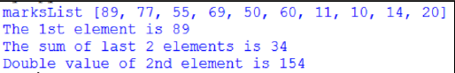

# Working with Lists
- Create a list called markListthat contains 10 elements.
- Display the value in the first element of markList.
- Add the values in the last two elements of markListand assign the result to the variable sum.
- Double the value in the second element of markList.

## Sample Activity Output
