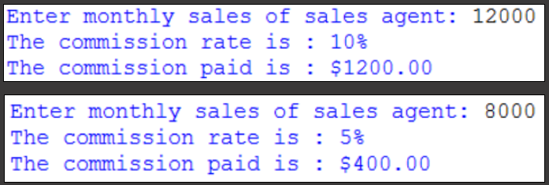

# Activity 04
ABC Company pays its sales agents on a commission basis. 

Each agent is paid 10% commission for monthly sales above or equal to $10,000 and 5% commission for monthly sales below $10,000.

Write a program to accept the monthly sales of a particular agent and based on the amount, determine and print out the commission earned.

