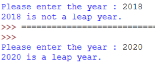

# Activity 5: Leap Year
A year is said to be a leap year if it is divisible by 4 but not divisible by 100, except those that is divisible by 400.

Write a program to determine if an input year is a leap year.

