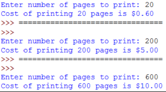

# Activity 06: Printing Rates
The rate for photocopy in a printing shop is as follows:

- First 100 pages: 3 cents per page
- Next 200 pages: 2 cents per page
- Over 300 pages: 1 cent per page

Calculate the cost for printing based on the number of pages input.

